#大数据简介
@(大数据)[数据收集,海量数据存储, 数据分析, 数据集合]
##什么是大数据技术
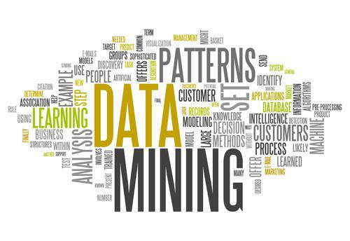
**[大数据][1]**，指无法在一定时间范围内用常规软件工具进行捕捉、管理和处理的数据集合，是需要新处理模式才能具有更强的决策力、洞察发现力和流程优化能力的**海量、高增长率和多样化的信息资产**。从各种各样类型的数据中，快速获得有价值信息的能力，就是**大数据技术**。这一点促使该技术具备走向众多企业的潜力。
#####大数据的**5V**特点（IBM提出）
- **Volume（数量）**：数据体量巨大。从TB级别，跃升到**[PB][2]**级别；
- **Variety（种类）**：数据繁多。数据量巨大，来源多渠道，如网络日志、视频、图片、地理位置信息等等。
- **Velocity（速度）**：处理速度要求非常快。百亿甚至千亿级别的数据经常要求在短时间内处理完毕。
- **Value（价值）**：价值密度低。以视频为例，连续不间断监控过程中，可能有用的数据仅仅有一两秒。
- **Veracity（真实性）**：数据质量高。获得能反映真实世界趋势的合理分析数据。
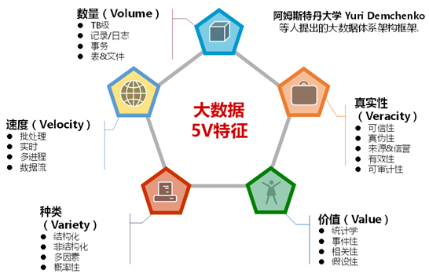
##大数据的核心价值
2010年《Science》上刊登了一篇文章指出，虽然人们的出行的模式有很大不同，但我们大多数人同样是可以预测的。这意味着我们能够根据个体之前的行为轨迹预测他或者她未来行踪的可能性，即**93%**的人类行为可预测。而大数定理告诉我们，在试验不变的条件下，重复试验多次，随机事件的频率近似于它概率。“有规律的随机事件”在大量重复出现的条件下，往往呈现**几乎必然**的统计特性。随着计算机的处理能力的日益强大，**你能获得的数据量越大，你能挖掘到的价值就越多。数据本身不产生价值，如何分析和利用大数据对业务产生帮助才是关键**。
#####大数据挖掘商业价值的方法主要分为四种
- **定制服务**：客户群体细分，然后为每个群体量定制特别的服务。
- **场景模拟**：模拟现实环境，发掘新的需求同时提高投资的回报率。
- **加强管理**：加强部门联系，提高整条管理链条和产业链条的效率。
- **降低成本**：降低服务成本，发现隐藏线索进行产品和服务的创新。
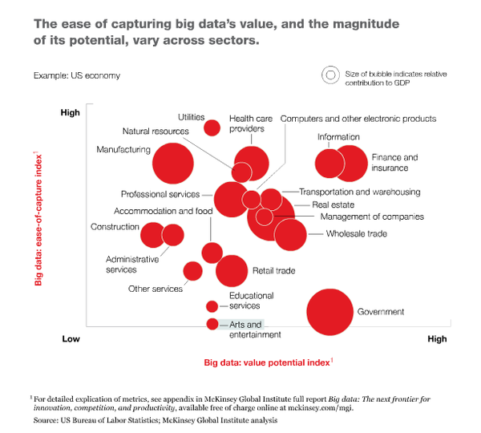
#####大数据的类型大致可分为三类
1. **传统企业数据（Traditional enterprise data）**：包括 CRM systems的消费者数据，传统的ERP数据，库存数据以及账目数据等。 
2. **机器和传感器数据（Machine-generated /sensor data）**：包括呼叫记录（Call Detail Records），智能仪表，工业设备传感器，设备日志（通常是Digital exhaust），交易数据等。 
3. **社交数据（Social data）**：包括用户行为记录，反馈数据等。如Twitter，Facebook这样的社交媒体平台。
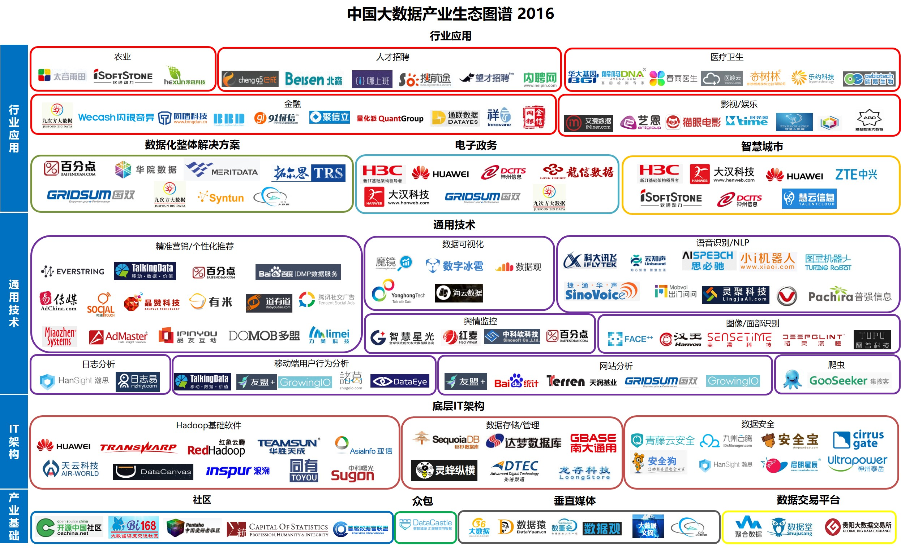
#####大数据的终极核心价值理念在于资源优化配置
具体来说，要实现大数据的核心价值，还需要前两个重要的步骤，第一步是通过各种技术来源**收集海量数据**，第二步是通过大数据的技术途径进行**全量数据挖掘**，最后利用分析结果进行**资源优化配置**。从理论上来看，所有产业都会从大数据的发展中受益。
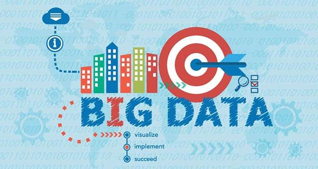

##大数据基础设施、工具和技术
###大数据存储和处理工具（开源）   
####基础框架：Hadoop
**[Hadoop][3]**是是一个能够对大量数据进行分布式处理的软件框架。它拥有如下几个优点（特点）：
- **高可靠性**：Hadoop按位存储和处理数据的能力值得人们信赖。
- **高扩展性**：Hadoop是在可用的计算机集簇间分配数据并完成计算任务的，这些集簇可以方便地扩展到数以千计的节点中。
- **高效性**：Hadoop能够在节点之间动态地移动数据，并保证各个节点的动态平衡，因此处理速度非常快。
- **高容错性**：Hadoop能够自动保存数据的多个副本，并且能够自动将失败的任务重新分配。
- **低成本**：与一体机、商用数据仓库以及QlikView、Yonghong Z-Suite等数据集市相比，hadoop是开源的，项目的软件成本因此会大大降低。

Hadoop框架自带两个核心模块：
1. **分布式文件系统(存储)[HDFS][10] **：在由普通PC组成的集群上提供高可靠的文件存储，通过将块保存多个副本的办法解决服务器或硬盘坏掉的问题。
2. **大数据处理工具[MapReduce][9]**：通过简单的Mapper和Reducer的抽象提供一个编程模型，可以在一个由几十台上百台的PC组成的不可靠集群上并发地，分布式地处理大量的数据集，而把并发、分布式（如机器间通信）和故障恢复等计算细节隐藏起来。而Mapper和Reducer的抽象，又是各种各样的复杂数据处理都可以分解为的基本元素。这样，复杂的数据处理可以分解为由多个Job（包含一个Mapper和一个Reducer）组成的有向无环图（DAG）,然后每个Mapper和Reducer放到Hadoop集群上执行，就可以得出结果。

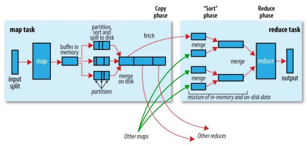

HDFS将巨大的数据集分派到一个由普通计算机组成的集群中的多个节点进行存储，例如Google的数据中心使用廉价的Linux PC机组成集群，在上面运行各种应用。即使是分布式开发的新手也可以迅速使用Google的基础设施。同时HDFS可索引和跟踪这些数据，大数据处理和分析效率得到极大提升。 **[MapReduce][9]**对大数据的处理方式可抽象为两个步骤：
1. 我们要数图书馆中的所有书。你数1号书架，我数2号书架。这就是“Map”。我们人越多，数书就更快。
2. 现在我们到一起，把所有人的统计数加在一起。这就是“Reduce” 。

主流的基于Hadoop的产品与解决方案包括：Hortonworks、Cloudera、MapR、星环等。

####大数据处理工具：Spark
**[Spark][4]是专为大规模数据处理而设计的快速通用的计算引擎**，对应Hadoop自带的MapReduce。实际上它是对 Hadoop 的补充，可以在 Hadoop 文件系统中并行运行。Spark必须和分布式文件系统进行集成才能运作，当然可以选择Hadoop的HDFS，也可以选择其他的基于云的数据系统平台。不过一般默认与Hadoop组合，这是公认的最好的组合。
#####Spark vs MapReduce
Spark的优点在于： 
-  **数据处理效率高**。Spark的批处理速度比MapReduce快近10倍，内存中的数据分析速度则快近100倍。尤其是对流数据或多重数据的处理上更是优势明显，而大部分机器学习算法都需要多重数据处理的。 
-  **开发效率高**。这是由Scala语言的特性和Spark的DAG机制所决定的。 当然Spark也有不尽如人意的地方，比如它在大规模集群上的稳定性相对较差。不过新版本的spark正在逐步解决这个问题。总体看来，大多数认为MapReduce将逐步被Spark所淘汰。

其实Hadoop是一个庞大的生态系统，除了核心的存储和处理模块之外，还涉及到非结构化数据处理、数据库、Hadoop监控等很多必要的技术和工具。
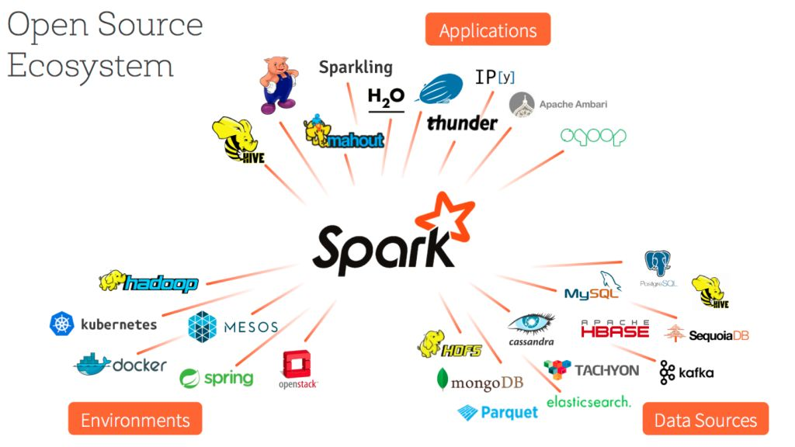
####大数据可视化工具：
- **国内的[魔镜分析工具][5]**：魔镜的大数据平台主要提供的还是数据清洗和ETL、Hadoop数据仓库以及一系列的数据分析服务，可提供的数据分析视图工具类型丰富。
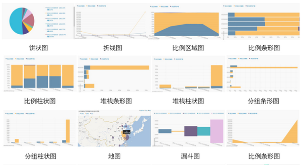
- **日志管理工具[Splunk][6]**：Splunk的功能组件主要有Forwarder、Serch Head、Indexer三种，然后支持了查询搜索、仪表盘和报表（效果真不是吹的，很精致呀），另外还支持SaaS服务模式。其中，Splunk支持的数据源也是多种类型的，基本上还是可以满足客户的需求。
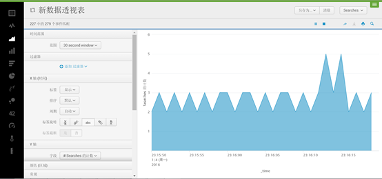
- **[Everstring][7]（数据建模）**：主要是通过大数据的预测分析建模为企业提供业务和客户推荐的SaaS服务，获取和积累了两个数据信息资源库，一个行业外部的资源库（公有SaaS收费形式），一个行业自己内部的资源库（私有），然后再通过机器学习和人工智能的方法对数据进行相应行业或是领域的建模，最后得到一个比较不错的结果，优化于人工可以得到的结果，而且Everstring也成为了初创大数据公司里面估值很高的公司。
- **[Tableau][8]（可视化图表）**：非常受欢迎的国外的数据可视化工具，价格较高，相对来讲也比较优质。
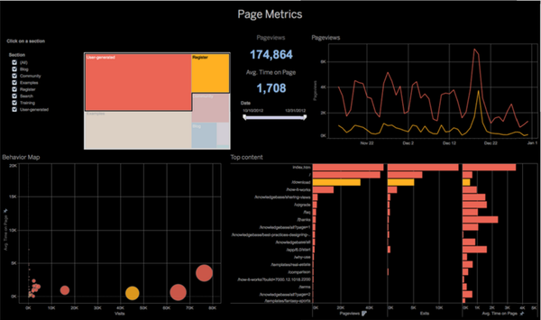
###机器学习技术
[机器学习][11]是指计算机从大量的数据中学习、归纳出有用的规则（模型、程序）的过程。这一过程中，计算机通过大量的数据训练样本和丰富的特征维度，学习到有用的模型（规则、程序），计算机程序随着经验积累自动提高性能。机器学习可应用在大数据分析、人工智能、用户画像、智能推荐、精准广告投放等各个领域。
##大数据的数据层面分析
###第一层面：基础数据的充分采集、处理、整合
人类决策/行动的过程开始于信息的采集，数据产业也如此。这一层面的关键点在于：数据源的多样化、数据维度和数据量的丰富、数据的清洗去噪、数据的结构化处理和整合。首先以用户画像中用到的基础数据为例，按照属性对数据进行下分类说明。
####1、数据属性分类
用户数据按属性可以分为用户静态信息数据和用户动态信息数据（用户行为）。用户静态信息数据可包括：  
- **人口属性**：性别、年龄、住址、户籍、职业、婚姻状况、家庭状况等等
- **商业属性**：收入、消费等级、消费周期、贷款历史等等 网站注册信息等等其他数据

用户动态信息数据由接触点和行为类型两部分组成：
- **接触点**：某社交网站、某电商首页、某单品页、某微博、某实际地点等等
- **行为类型**：浏览、点击、搜索、发表、点赞、下单等等。也包括某些阈值，比如某行为多少次、持续多长时间等等。

由于用户静态信息数据较为稳定、且往往是结构化的数据，在用户画像的过程中，对用户动态信息数据的采集和处理更为关键。
####2、基础数据来源
海量的基础数据的可以来自企业自身、政府/第三方、众包、互联网和线下。  
#####企业自身数据
企业自身的数据同企业的经营相关度最高，数据中蕴藏了丰富的商业价值。可以由以下几个来源获取：
- **网站/app页面监测（onsite）**：包括交互行为、滚屏、鼠标轨迹等等。
- **用户调查和反馈**：可以有问卷、Feedback、客服系统提交的直接需求等多种形式。
-  **企业运营数据**：如订单量、交易金额、人力数据等等。这些数据往往由企业的CRM和ERP等传统BI中接入，当然也可能通过优惠券、二维码等形式采集而得。 
#####政府/第三方
一些重要的政府部门和各领域的机构或企业掌握了大量数据，普通企业可通过购买或授权合作获取。其中，在金融领域，对个人征信和反欺诈最有价值的数据来自征信公司（即将拿到个人征信牌照的公司包括腾讯、阿里、鹏元、中智诚征信公司等8家）、电信运营商数据（运营商的用户行为数据特别是移动用户的行为数据，商业价值非常大）和银联数据。下面列举了一些细分领域数据的主要来源：
- **政府的数据**：如天气的数据可以应用于农业和工业规划；税务、工商、公安司法数据可以用于征信和信贷风控；土地和人口数据可以用于规划和地产；经济统计数据可以用于企业经营决策和政府规划。政府的数据优点在于全和多，但数据比较分散，质量一般。
- **向各领域企业或机构购买或交换的数据**。如金融领域的Wind资讯、万得信息、九次方、同花顺、恒生电子；影视/娱乐领域的克顿、猫眼电影、奥科软件、无锡天脉聚源建；地理/环境领域的长地万方、凯立德、北京城际高科、中科宇图、科菱航睿；通讯信息领域的电话帮、小源科技等等。
#####众包（Crowdsourcing）
 一些数据平台通过数据交换或购买的方式，吸引广大用户上传语音、图片等数据。典型的如数据堂。
#####互联网（online）
 散落在互联网上的数据主要通过爬虫技术抓取。首先按照预设定的主题，先通过URL分析，丢弃部分URL；下载页面，对页面内容进行主题提取，对比预设定的主题做取舍；最后进行数据清洗。在这一领域，国内的八爪鱼是个很好的例子，它提供了一个自动化的网页爬虫解决方案，受到了市场的欢迎。
 
 开源的爬虫框架主要有分布式爬虫（Nutch）、JAVA单机爬虫（Crawler4j、WebMagic、WebCollector）、非JAVA单机爬虫（scrapy）。这些工具各有利弊，不过一般认为，由于用Nutch难度大、耗时长，如果不是为了做搜索引擎或精准数据爬取，尽量不要选择Nutch作为爬虫。
 
 除了自己爬虫外，一些一些数据平台以下发任务、众包的方式，通过数据购买或交换，吸引广大用户利用闲置计算资源协助其进行爬虫。  当然，人们在网页上肆意爬取数据时也会遇到各种问题：  
 - 社交、电商等网站为了守住自己的数据，会采取各式各样的反爬虫策略。比如针对频繁访问网站的IP设定访问限制，使用js和ajax技术的动态页面等等。但是兵来将挡水来土掩，真正的爬虫高手往往能采取相应的对策破解。随着爬虫和反爬虫之间的博弈你来我往、反爬虫策略创新不断，要做好爬虫，必须拥抱变化、见招拆招。
 -  网络上多为非结构性文本，要求较高的自然语言分析能力。
 -  网页爬虫最大的硬伤是，在很多商用场景中，网上爬来的数据往往关联性较弱，价值几许未得到充分验证。
#####线下（offline） 
 比如利用各种传感器收集到的数据。如国外一些电子发烧友玩儿的RaspberryPi、Arduino等等。
####3、基础数据综合交易/查询平台
一些数据平台通过上述各种渠道采集各类具备潜在价值的数据，经过清洗、结构化处理、整合，生成API接口或数据包，出售或出租给企业用户。典型的数据平台有聚合数据、数据堂、APIX等。
- 聚合数据

聚合数据面向智能手机开发者、网站站长、移动设备开发人员及图商，提供原始数据API服务。数据涵盖金融、日常生活、地图、天气等各领域。其功能类似于百度apistore和Google APIS。
- 数据堂

数据堂的商业模式可以概括为两个方面，一是面向 B 端客户提供定制化数据源服务，二是大数据交易平台。在数据采集上，数据堂提供了较成熟的众包采集平台，包括众采平台、众标平台和众爬平台。用户在采集数据的同时，也顺便甄别了数据的真伪和有效性。另外，数据堂对非结构化数据具备较强的处理能力，如消费票据处理、人脸识别、物体识别等精细分类数据。
###第二层面：分析、挖掘、画像
基础数据在被充分采集、处理和整合后，需要机器进一步分析、发掘，并完成可视化或完整的画像。这一阶段至关重要，因为它产出的结果可以直接指导人类决策，或为实现人工智能打下基础。

数据源中较容易采集的是onsite数据，即对自家网站/APP进行页面监测，也就是用户行为分析。
####1、网站/app页面监测和分析
网站/APP开发和运营者通过监测和分析用户行为改善用户体验，或构建用户画像，提供精准的推荐、服务。
#####埋点 vs 免埋点
传统的用户行为分析需要前端工程师在相应的位置写代码埋点，然后在后台自行分析、挖掘数据。后来为了更好的可视化，出现了一些工具可以形成更友好的报表或dashboard，并辅助进行数据挖掘，当然埋点的过程还是需要前端工程师来帮忙的。比较常用的包括Google Analytics、Adobe Analytics、Omniture、Fullstory、百度统计、诸葛IO、Talkingdata、友盟等等。最近又有一些工具宣称可以直接面对业务人员，免去埋点，实现可视化配置和实时数据分析。这类工具包括Heap Analytics(免埋点技术的鼻祖)、GrowingIO、诸葛IO等。但这些工具的缺点也很明显，比如滚动条高度、及其他稍复杂的监控都无法做到，如果需要采集全方位的数据进行更专业的分析，仍需要靠开发人员来埋点配置。  
#####可视化
利用Google Analytics、Heap Analytics、GrowingIO等工具，能把监测结果可视化出来，辅助业务人员进行分析和挖掘。常见的可视化结果包括热力图（记录滚屏等行为）、鼠标轨迹图、转化漏斗、趋势图、用户行为路径列表、分析报告和dashboard。这之中dashboard最为用户友好， 它简明扼要地展现了所有关键信息和必要的细节，当然展现关键信息和细节是相互矛盾的，如何把握二者的平衡，是做dashboard中非常艺术的地方。
#####Tag manager 
在一个页面中，我们往往需要塞满各种功能代码，例如做用户监测、营销工具、RTB（实时竞价）。如何进行统一管理、统一修改，而不用劳烦技术人员呢？这就需要一类叫做tagmanager的工具。这类工具将所有代码统一集中到第三方的服务器上的一个.js文件中，页面上只放一段代码，用于调用这个外部的.js文件。这类工具中常用的有：Ensighten、TrackingFirst、GoogleTagManager。

另外，tag manager正将向app监测领域的延伸，即统一管理监测sdk的工具，原理与页面监测类似，值得持续关注。
#####其他基于网站/APP监测的工具
基于网站/app页面监测和分析的结果，一些工具可以根据算法直接做出预测和分析结果，供产品经理参考。比如：TalkingData提供游戏运营分析工具，基于大量的数据积累，通过特定算法预测哪些用户可能流失，哪些用户有可能付费。GrowingIO喊出了“人人都有分析师”的口号，采用机器学习技术，自动计算出哪些数据是重要的，不断优化到系统里去，不只返回报表，更给出分析结果。

还有一些工具可以开启自动触发机制。比如：Blindspotter会基于异常行为自动报警并做相应处理；Trak更像是用户智能管理工具，会根据监测到的行为触发邮件发送，比如定期向长久不来的用户发送唤醒邮件，向近期比较活跃的用户发送新版本测试邀请，用户状态的变更提醒等。
####2、日志数据分析
大型企业的系统会产生海量的日志，如何管理这些日志，并从中挖掘出有价值的信息？国外的Splunk、SumoLogic和LogEntries，国内的日志易、翰思均可实现相关的功能。
以日志易为例，日志易可实现以下多种功能：
- **日志采集**：准时实地采集业务系统产生的日志。
- **搜索、日志数据结构化**：具有搜索分析功能，方便用户快速定位问题。能够自动从日志中提取关键字段，将非结构化日志转化为结构化数据。
- **监控告警**：触发告警配置时，及时通过邮件或者短信告警。
- **安全审计**：自动检测SQL注入攻击、跨站请求和代码注入等安全渗透攻击及违规操作，从而允许用户进行安全审计。
- **可视化**：将日志数据可视化，方便用户创建各种统计视图。
####3、企业运营管理可视化
**[商业智能][12]**（BI）这个词意义宽泛，理解层面不同，定义也就不同。由于有些企业对自身运营管理数据较为敏感，这类工具通常提供公有云和私有云两种部署方式供企业选择。国外常用的工具有：Dundas、Sweetspot、RJMetrics、tableau、QlikView等。国内的工具有：华院数据、美林数据、龙信数据、星图数据、融智网信、拓尔思、永洪科技等。其中，永洪科技较为典型。永洪科技主要面向各行业毫无IT知识的管理者或一线业务人员，提供敏捷、高性能、自服务的数据可视化平台，指导企业及其本人的数据化运营、日常工作和个体业务决策。目前已为能源、旅游、传媒、金融、电信等多个行业企业提供服务。
####4、用户画像
毫无疑问，个性化技术是企业利用大数据产生价值的重要落地点，“**用户画像**”这一概念便应运而生。用户画像完美地抽象出一个用户的信息全貌，可以看作企业应用大数据的根基。

用户画像用一句话概况：用户信息标签化。即采集用户静态和动态信息数据，利用计算模型产出标签和相应地权重，从而使得计算机能够程序化处理与人相关的信息，甚至通过算法、模型能够“理解”人。
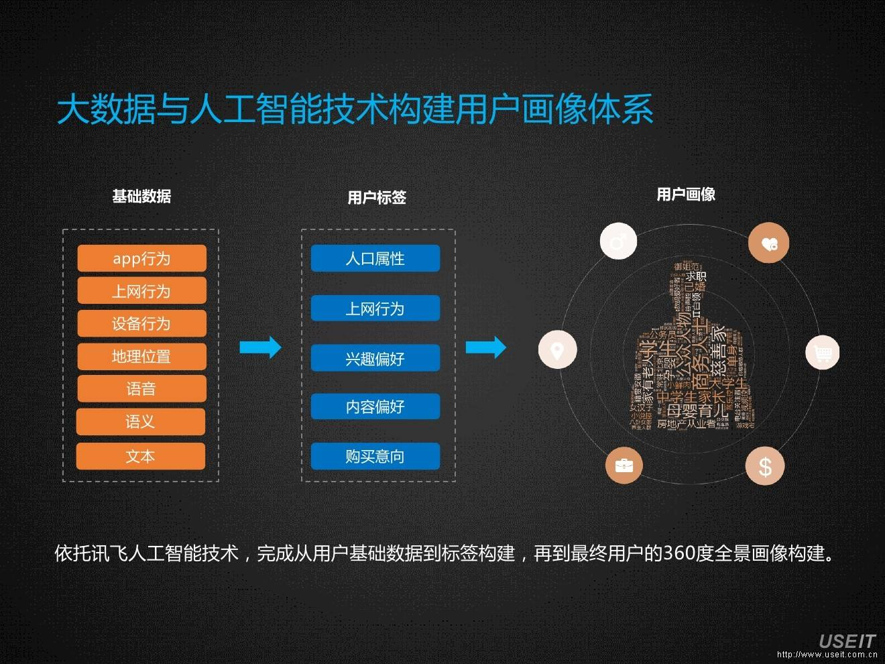

#####如何构建用户画像?
- 首先为了区分用户、单点定位，要进行用户标识。常见的标识方式包括：Cookie、注册ID、Email、QQ、微信、微博、手机号、身份证等。获取方式由易到难。视企业的用户粘性，可以获取的标识信息有所差异。
- 然后，通过各种方式采集相关的用户数据，利用数据模型，为该用户打上标签和相应权重。标签表征属性或内容，表示用户具备该属性，或对该内容有兴趣、偏好、需求等等。权重可以简单的理解为用户具备该标签的可信度、概率。

比如：用户A昨天在品尚红酒网浏览一瓶价值238元的长城干红葡萄酒信息。标签和权重可以是这样的：用户Ａ：红酒0.665、长城0.665

构建企业、商品等各类主体的画像时所用方法雷同，重点在于利用模型确定标签和权重的过程。基于完整画像的构建，推荐引擎、广告精准投放、征信等服务才得以实现。
###第三层面：推荐、预测、行动
《大数据时代》的作者维克托·迈尔·舍恩伯格认为：”大数据的核心就是预测“，”大数据不是要教机器像人一样思考。相反，它是把数学算法运用到海量的数据上来预测事情发生的可能性“。凯文·凯利认为，相比于“人工智能”，这一技术领域应叫做”异类智能“（AI，AllienIntelligence）更为准确，智能推荐、预测、判断都应该算做异类智能的范畴，而不应只局限于人形的机器人。 

 异类智能是数据产业中最诱人的部分，它用大数据的方式达到人类所不能达到的规模化、高效率和高精度。当然，异类智能的实现是建立在数据产业前两个层面之上的。
####1、精准服务、推荐和营销
Everstring、Talkingdata、今日头条是这一领域的几家典型企业，以下通过对这些企业的简单介绍，对这一领域做些阐释。
- **Everstring**
Everstring是一家国内的团队，但主要面对的是美国客户。Everstring面向高科技、电信和保险等行业的企业，为它们全网寻找潜在企业客户。所需的数据来源主要有：企业客户内部数据（CRM系统）、挖掘全网在线企业数据及购买企业数据。Everstring系统利用自然语言分析、非监督机器学习自动建立客户模型，首先分析企业现有客户，然后再利用模型在全美国寻找最像企业现有客户的潜在客户。目前该公司已经积累了美国近700万家企业画像数据，在北京也已设立了数据科学和工程研发团队。 
 
- **Talkingdata**
Talkingdata利用自己在移动应用领域丰富的数据积累，提供轻量级的智能推荐服务接口，主要业务包括移动应用推荐、广告投放优化、用户画像、游戏数据挖掘等。
- **今日头条**
今日头条的推荐算法团队有几百人，他们依据客户浏览习惯，为客户提供诸如新闻、财经、视频、专栏的精准内容。
- **摸象数据**
摸象数据自主研发了一套电商推荐引擎，为互联网用户提供个性化消费推荐和服务的同时，为品牌&企业客户提供大数据分析、推荐引擎平台建设以及精准广告和效果营销。

目前精准服务、推荐和营销领域是数据产业链条中商业价值最为清晰的一块，这里只举了几个典型的例子，类似的公司还有lytics，百分点等等。
####2、金融领域
在金融领域，风控是重中之重。这两年由欠债问题引发的“P2P跑路潮”，其核心原因是金融机构缺乏对借款人进行有效的信用风险管控。国内外有很多企业在利用大数据，在征信领域探索着“异类智能”的应用。
- **Zestfinance**（美国）
Zestfinance主要服务人群是约占人口5%的、信用评分在500分以下的次级贷人群。它开发出有效的信贷审批模型，致力于为每一个人信用进行评估，创造公平而且透明的信用信息，帮助那些信贷信息不完整的人群享受正常金融服务的权利。其核心竞争力在于强大的数据挖掘能力和模型开发能力和量化的信用风险分析技术。相对于银行/典当行，Zestfinance具备获得贷款顾客的成本低，首次还贷违约率低，投资回报率高等优势。
在ZestFinance的新模型中，往往要用到3500个数据项，从中提取70,000个变量，利用欺诈模型、身份验证模型、预付能力模型、还款能力模型、还款意愿模型、稳定性模型等十几个预测分析模型进行集成学习或者多角度学习，判断出消费者的还款能力和还款意愿，进而得到最终的消费者信用评分。 
数据源方面，主要收集传统银行信贷的数据（如账户数、信贷历史、违约数、流水）及其他结构化的数据（如交租情况、搬家次数等）。Zestfinance认为，文本数据和社交网络数据等与消费者的信用风险相关性太弱，因此利用得比较少。
- **同盾科技**
同盾科技为企业提供云端风险管控和反欺诈服务，主要服务对象为银行、第三方支付、信贷、电商、游戏、社交等企业。可根据客户要求提供SaaS化服务或私有云部署的反欺诈系统。
公司对贷款人的身份信息、手机、身份证等数据与其线上行为进行强大关联，建立全方位网络行为图谱；并致力于建立跨行业黑名单，使坏人一处作祟，处处受限；收集和整理全网大规模的网络黑名单信息，并要求客户企业继续上载新的黑名单信息。  总体来看，美国的征信机构对贷款人的信用评估大多基于无罪推定，进行足够的量化分析，致力于为每个人进行信用评估，打破信贷机构为富人服务的怪圈。而国内征信机构倾向于以有罪推定为前提，搭建黑名单制度，惩罚性更强，且量化分析能力较差，征信机构的信用评分机制尚未推出。当然这主要是因为中国还未建立出统一、标准的征信体系，而阿里、腾讯、京东交易体系产生的海量数据目前主要闭环使用，服务于自身业务。我国的征信业还有很长的路要走。
####3、国防领域
这一领域以Palantir最为典型。Palantir共拥有两大产品线，即PalantirGotham和PalantirMetropolis，分别应用于国防和金融领域。在国防方向，尽管CIA、FBI等情报机构掌握着成千上万个数据库，但要在这些数据之间建立联系，却相当耗费时间，Palantir利用强大的算法和引擎整合相互分离的数据库，进行高效的搜索、分析和数据挖掘，能够快速找出有价值的线索，提前掌握恐怖份子可能发动袭击的消息。在金融方向，Palantir曾帮助多家银行追回了前纳斯达克主席BernieMadoff所隐藏起来的数十亿美元巨款，而很多银行和对冲基金客户则大多利用Palantir探测欺诈行为和评估贷款风险。
####4、物流/交通领域
以滴滴为例。滴滴的数据分析和应用团队有300多人，它设计了不同的数据模型，可以实现：依据客户和司机的位置为客户推荐出租车或专车，依据司机抢单情况来给司机安排客户，依据客户订单多少提升客户等级和订车优先权。

[1]:http://baike.baidu.com/item/%E5%A4%A7%E6%95%B0%E6%8D%AE/1356941
[2]:http://baike.baidu.com/item/PB/399855
[3]:http://baike.baidu.com/item/Hadoop
[4]:http://baike.baidu.com/item/SPARK/2229312
[5]:http://www.moojing.com/home/
[6]:http://www.splunk.com/
[7]:http://www.everstring.com/
[8]:http://www.tableau.com/
[9]:http://baike.baidu.com/item/MapReduce
[10]:http://baike.baidu.com/item/hdfs
[11]:http://baike.baidu.com/item/机器学习
[12]:http://baike.baidu.com/item/商业智能